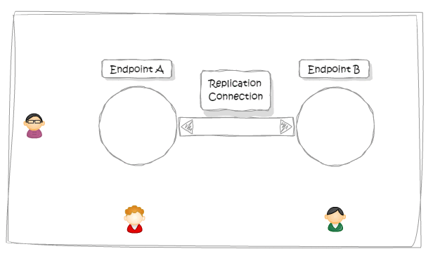

Eventuate
=========

Eventuate is a toolkit for building applications composed of event-driven and event-sourced services that communicate via causally ordered event streams. Services can either be co-located on a single node or distributed up to global scale. Services can also be replicated with causal consistency and remain available for writes during network partitions. Eventuate has a [Java](http://www.oracle.com/technetwork/java/javase/overview/index.html) and [Scala](http://www.scala-lang.org/) API, is written in Scala and built on top of [Akka](http://akka.io), a toolkit for building highly concurrent, distributed, and resilient message-driven applications on the JVM. Eventuate

- provides abstractions for building stateful event-sourced services, persistent and in-memory query databases and event processing pipelines
- enables services to communicate over a reliable and partition-tolerant event bus with causal event ordering and distribution up to global scale
- supports stateful service replication with causal consistency and concurrent state updates with automated and interactive conflict resolution
- provides implementations of operation-based CRDTs as specified in [A comprehensive study of Convergent and Commutative Replicated Data Types](http://hal.upmc.fr/file/index/docid/555588/filename/techreport.pdf)
- supports the development of *always-on* applications by allowing services to be distributed across multiple availability zones (locations)
- supports the implementation of reliable business processes from event-driven and command-driven service interactions
- supports the aggregation of events from distributed services for updating query databases
- provides adapters to 3rd-party stream processing frameworks for analyzing event streams

Documentation
-------------

- [Home](http://rbmhtechnology.github.io/eventuate/)
- [Overview](http://rbmhtechnology.github.io/eventuate/overview.html)
- [Architecture](http://rbmhtechnology.github.io/eventuate/architecture.html)
- [User guide](http://rbmhtechnology.github.io/eventuate/user-guide.html)
- [Reference](http://rbmhtechnology.github.io/eventuate/reference.html)
- [API docs](http://rbmhtechnology.github.io/eventuate/latest/api/index.html)
- [Articles](http://rbmhtechnology.github.io/eventuate/resources.html)
- [FAQs](http://rbmhtechnology.github.io/eventuate/faq.html)

Project
-------

- [Downloads](http://rbmhtechnology.github.io/eventuate/download.html)
- [Contributing](http://rbmhtechnology.github.io/eventuate/developers.html)

Community
---------

- 
- [Mailing list](https://groups.google.com/forum/#!forum/eventuate)

Shouldn't CRDTs be more educated?
---------

-   In a happy world where nothing bad ever happens, there is nothing to worry about (*). We could even live without CRDTs or conflict resolution algorithms.

    (*) This is not entirely true because even without bad things happening like network partitions or nodes going down, there is still a chance of concurrent operations modifying the same data, hence generating conflicts. But the scenario helps me to explain my point).

    

    If [Ariel Arnaldo Ortega](https://en.wikipedia.org/wiki/Ariel_Ortega) would like to play a Match he would only have to inform to his friends and the first of them who responds will play. The other one will watch it on TV and Ortega and his opponent will face in the field.

-   But guess what?, s**t happens and more often than we could guess.

    

    So, after Ortega has informed his friends, a network partition could occur. In this situation, if [Marcelo Gallardo](https://en.wikipedia.org/wiki/Marcelo_Gallardo) would accept the challenge, [Ramiro Funes Mori](https://en.wikipedia.org/wiki/Ramiro_Funes_Mori) would not notice and he could accept it too. If the system were not builded for handling this conflict we couldn't guess the final state of the Match and the three of them could end up in the field, with one of them having to go home early. Such a mess!

-   So, Should we give up and learn to live with conflicts? Of course not, conflict resolution algorithms and CRDTs are here to save the day.

    

    If the system were builded with CRDTs for conflict resolution we could have avoided all the mess. Even if both players were been accepted by the system to play, the CRDT would end up resolving that only one of them should play. Let's say that the player who is currently in activity has priority. Damn youngs, show some respect to the elders!
    But wait! Gallardo will still showing up in the field to play against Ortega. Did anyone had the decency of telling him? Well, the CRDT may have saved us from the conflict, but he also has been a bit rude with Gallardo by not telling him he has been kicked out.

-   Well, we should be thankful to the CRDT because at the end he has saved us for any conflict. But shouldn't the CRDT be more educated?

    

    So please CRDT, if Gallardo has been kicked out at least be kind and **APOLOGISE** him.
